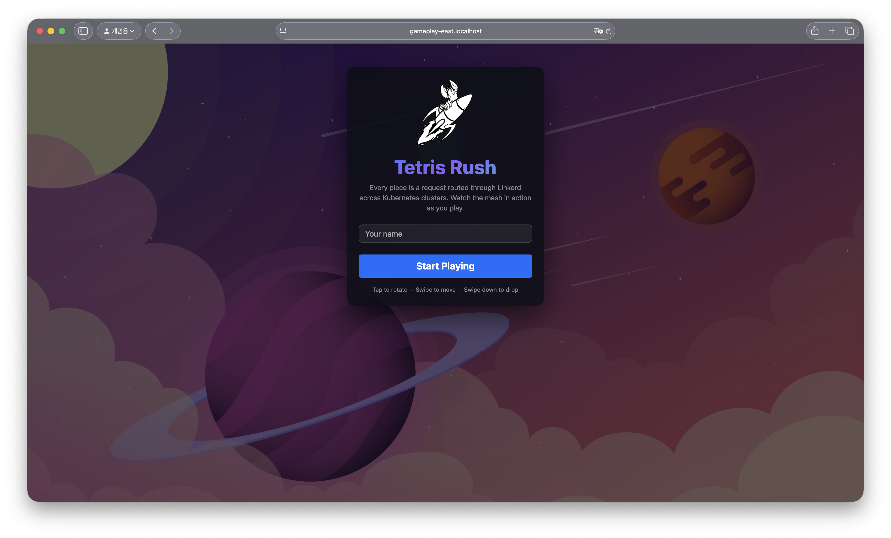
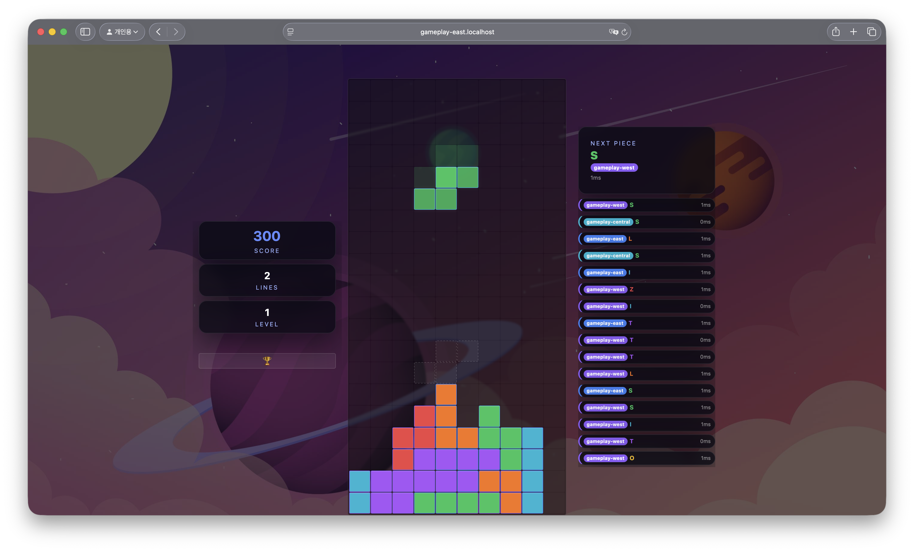
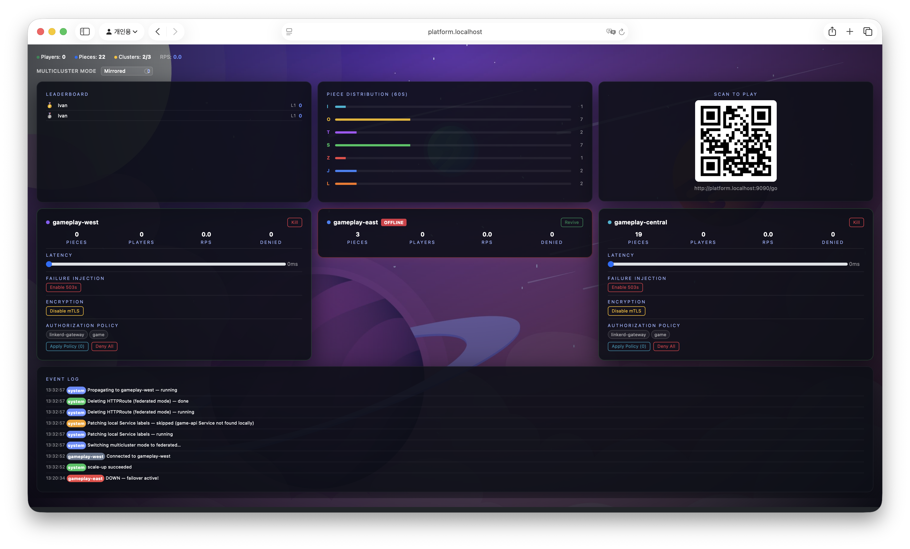
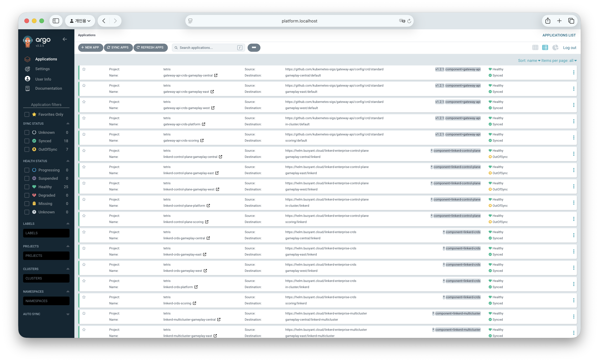

# Linkerd Tetris Rush

A live demo platform for showcasing Linkerd's multi-cluster service mesh capabilities through an interactive Tetris game. Players join via QR code, play Tetris across a distributed cluster topology, and a presenter dashboard visualizes traffic flows, mesh scenarios, and cluster health in real time.

## Screenshots

### Player Login
Players join by scanning the dashboard QR code and entering their name.



### Tetris Gameplay
The game board with score tracking, level progression, next piece preview, and a live leaderboard.



### Presenter Dashboard
Real-time overview of cluster health, traffic distribution, scenario controls, leaderboard, and event log.



### Argo CD
GitOps deployment view showing all applications across clusters (when using the `k3d-argocd.sh` setup script).



## Components

| Component | Language | Framework | Purpose |
|-----------|----------|-----------|---------|
| `game-api` | Python | FastAPI | Game backend: piece generation, scenario effects, proxies scoring to leaderboard-api |
| `game` | JavaScript | Express + React | Player UI: 10x20 game board, controls, piece preview |
| `leaderboard-api` | JavaScript | Express | Scoring backend: player registration, score submission, leaderboard |
| `agent` | JavaScript | Express | Admin API: Kubernetes scaling, cluster discovery, scenario toggles |
| `dashboard` | JavaScript | Express + React | Presenter UI: traffic visualization, cluster cards, leaderboard |
| Redis | - | - | Shared cross-cluster state: players, game stats, event logs |

All components are containerized with multi-stage Docker builds and deployed via a single Helm chart.

## Project Structure

```
linkerd-tetris-rush/
├── api/
│   ├── tetris-api/          # FastAPI backend (Python 3.12)
│   ├── leaderboard-api/     # Express leaderboard API (Node.js)
│   └── agent/               # Express admin API (Node.js)
├── tetris/
│   ├── server/              # Express proxy server
│   └── client/src/          # React game frontend
├── dashboard/
│   ├── server/              # Express proxy server
│   └── client/src/          # React dashboard frontend
├── helm/tetris/             # Helm chart for all components
├── scripts/
│   ├── k3d.sh               # Multi-cluster setup (direct Helm)
│   ├── k3d-argocd.sh        # Multi-cluster setup (Argo CD)
│   └── local-dev.sh         # Local development helper
└── docs/                    # Architecture and deployment guides
```

## Cluster Architecture

The project deploys across five domain-based K3d clusters, each owning a specific part of the application:

| Cluster | Domain | Services | Purpose |
|---------|--------|----------|---------|
| `k3d-gameplay-east` | Gameplay | game, game-api, agent | Player-facing region 1 |
| `k3d-gameplay-west` | Gameplay | game, game-api, agent | Player-facing region 2 |
| `k3d-gameplay-central` | Gameplay | game, game-api, agent | Player-facing region 3 |
| `k3d-scoring` | Scoring | leaderboard-api, Redis | Centralized scoring and player data |
| `k3d-platform` | Operations | dashboard, agent, Argo CD | Presenter dashboard, admin controls, GitOps |

When users scan the Dashboard QR code, they are randomly routed (round-robin) to one of the three game LoadBalancer services (one per gameplay cluster). The presenter dashboard on `platform` aggregates data from all clusters. The `leaderboard-api` on `scoring` is a hard cross-cluster dependency called by every `game-api` instance through the Linkerd mesh.

## Demo Scenarios

The following scenarios can be toggled per-cluster from the presenter dashboard:

### Disable mTLS

Can be enabled selectively on each gameplay cluster. When mTLS is disabled on a cluster:
- The `game-api` and `game` deployment specs in that cluster receive the `linkerd.io/inject: disabled` annotation, removing the Linkerd sidecar proxy.
- 80% of pieces served to players on that cluster appear corrupted (rendered in black), visually demonstrating the loss of encryption.
- All requests are routed locally within the cluster only — federated/mirrored services become unreachable since the workload is no longer part of the mesh.

### Deny All (Server Resource)

Can be enabled selectively on each gameplay cluster.
When applied:
- A Linkerd `Server` resource is deployed targeting the `game` pods. As result only clients that have been explicitly authorized may access the `game-api`.
- All unauthorized requests routed to the `game-api` on that cluster receive a 403 denial, which the game UI surfaces as a blocked-request indicator.
When disabled:
- A Linkerd `Server` resource targeting the `game` pods is deleted.
- All unauthorized requests routed to the `game-api` on that cluster start working as expected.

### Deny All with Authorization Policy

Can be enabled selectively on each gameplay cluster. From the dashboard, the presenter can select which clients to authorize (e.g., `linkerd-gateway`, `game`).
When applied:
- A Linkerd `AuthorizationPolicy` and `MeshTLSAuthentication` resource are deployed.
- Only traffic matching the specified client identities is permitted; 35% of other requests are denied with a 403.
When disabled:
- A Linkerd `AuthorizationPolicy` and `MeshTLSAuthentication` resource are deleted.
- **Gateway:** The `linkerd-gateway` identity is the only relevant identity, where cross-cluster traffic is tunneled through the multicluster gateway.
- **Remote-Discovery/Federated:** Cross-cluster traffic goes directly pod-to-pod, the identity presented need to be `game`.

### Latency Injection

Can be enabled selectively on each gameplay cluster via a slider (0-3000ms). When enabled:
- The `game-api` injects artificial sleep per request, up to the configured milliseconds.
- Players see a `"Fetching piece..."` spinner and a latency badge on each piece showing the response time.
- **Gateway/Remote-Discovery:** The latency keeps affecting the endpoints as they are blindly routed there. `RandomAvailableSelection` distributes requests according to configured backend weights with no awareness of latency — a slow backend receives the same share of traffic as a healthy one.
- **Federated:** The selection of the endpoints is based on P2C + PeakEwma. If an endpoint is slow, PeakEwma records the higher RTT and P2C deprioritizes it, routing most requests to faster endpoints. Traffic is not completely cut off — P2C still occasionally picks the slower endpoint, but the majority shifts to healthy ones.

### Kill (No Endpoints)
When you click `Kill` or `Revive`, it scales the game-api deployment down to 0 or up to 1 replicas. The killed services referenced in the `HTTPRoute` will be processed by the proxy. Because they have no endpoints, it zeros out the weight for that backend and tries the next one.

### Failure Rate (Status Code 503)
It will return 503 to all requests to the `game-api`.

- **Gateway/Remote-Discovery:** `HTTPRoute` splits traffic across 3 backends with equal weight. RandomAvailableSelection randomly picks a backend. If it picks an endpoint of a service with failure injection enabled, it returns 503, then the `game` retries. Circuit-breaking one gateway IP takes out the entire cluster's traffic for that backend, as it applies to the gateway.
- **Federated:** All endpoints from all clusters are unioned into a single P2C balancer pool. If P2C picks an endpoint with failure injection enabled, it returns 503, then the `game` retries. Circuit-breaking is per-pod, so only the specific failing pods get ejected while healthy pods in the same cluster continue serving. By default, the proxy does not have failure accrual enabled, so 503 responses pass through without triggering circuit breaking. However, failure accrual can be configured with:

```
kubectl annotate svc game-api-federated -n tetris \
  balancer.linkerd.io/failure-accrual=consecutive \
  balancer.linkerd.io/failure-accrual-consecutive-max-failures="1" \
  balancer.linkerd.io/failure-accrual-consecutive-min-penalty="1m" \
  balancer.linkerd.io/failure-accrual-consecutive-max-penalty="1m" \
  balancer.linkerd.io/failure-accrual-consecutive-jitter-ratio="0.5" \
  --overwrite
```

or removed via:

```
kubectl annotate svc game-api-federated -n tetris \
  balancer.linkerd.io/failure-accrual- \
  balancer.linkerd.io/failure-accrual-consecutive-max-failures- \
  balancer.linkerd.io/failure-accrual-consecutive-min-penalty- \
  balancer.linkerd.io/failure-accrual-consecutive-max-penalty- \
  balancer.linkerd.io/failure-accrual-consecutive-jitter-ratio-
```

**Note:**  Even with failure accrual enabled, occasional 503s will still reach the frontend. These are probe requests — after the penalty period expires, the breaker reopens and sends a test request to check if the endpoint has recovered. If it still fails, the 503 leaks to the client before the breaker trips again. Increasing min-penalty reduces their frequency but cannot eliminate them entirely. A retry policy would be needed to fully hide probe failures from the client.

## Multi-Cluster Topology Modes

The topology mode can be switched live from the dashboard using a dropdown.

### Federated to Mirrored

- Changes the `game-api` service annotation in all gameplay clusters from `mirror.linkerd.io/federated=member` to `mirror.linkerd.io/exported=remote-discovery`.
- An `HTTPRoute` is deployed in each gameplay cluster with `parentRef: game-api` and backends splitting traffic equally (33%) across the local `game-api` and the remote mirrored services (`game-api-gameplay-*`).
- The `game` targets the `game-api` service directly instead of `game-api-federated`.

### Mirrored to Gateway

- Changes the `game-api` service annotation in all gameplay clusters from `mirror.linkerd.io/exported=remote-discovery` to `mirror.linkerd.io/exported=true`.
- The existing `HTTPRoute` configuration remains unchanged — the `game` continues targeting the `game-api` service.

### Mirrored/Gateway to Federated

- Changes the `game-api` service annotation in all gameplay clusters from `mirror.linkerd.io/exported=remote-discovery` or `mirror.linkerd.io/exported=true` back to `mirror.linkerd.io/federated=member`.
- The `HTTPRoute` resources are deleted, and the `game` changes to targeting the `game-api-federated` service.

## Endpoints

After deployment, the following endpoints are available:

| Endpoint | URL | Description |
|----------|-----|-------------|
| Player (gameplay-east) | `http://gameplay-east.localhost:8080` | Tetris game |
| Player (gameplay-west) | `http://gameplay-west.localhost:8081` | Tetris game |
| Player (gameplay-central) | `http://gameplay-central.localhost:8082` | Tetris game |
| Presenter Dashboard | `http://platform.localhost:9090` | Admin dashboard |
| Argo CD | `https://platform.localhost:9091` | GitOps UI (when using `k3d-argocd.sh`) |

## Debug

```
kubectl get pods,svc,httproute,server -n tetris --context k3d-gameplay-east
kubectl get pods,svc,httproute,server -n tetris --context k3d-gameplay-west
kubectl get pods,svc,httproute,server -n tetris --context k3d-gameplay-central
kubectl get pods,svc,httproute,server -n tetris --context k3d-scoring
kubectl get pods,svc,httproute,server -n tetris --context k3d-platform
```

## Setup

Refer to the detailed guides in `docs/`:
- [Architecture](docs/architecture.md) — System design, request flows, and Redis data model
- [K3d Deployment](docs/k3d-deployment.md) — Full k3d + Linkerd installation steps
- [Local Development](docs/local-development.md) — Setup and debugging
- [Demo Modules](docs/modules.md) — Detailed scenario descriptions

### Federated Mode

In federated mode, each gameplay cluster exposes a `game-api-federated` ClusterIP service that aggregates traffic across local `game-api` instances. The `agent` services in gameplay clusters connect to Redis on the `scoring` cluster via a cross-cluster LoadBalancer. The dashboard on `platform` reaches remote `agent` instances through mirrored services. The `game-api` calls `leaderboard-api` on the `scoring` cluster for all player registration, score submission, and leaderboard queries.

```
┌─────────────────────────────────────────────────────────────────────────────────┐
│                              k3d-gameplay-east                                  │
│                                                                                 │
│  ┌─────────────────────────┐                                                    │
│  │  game                   │                                                    │
│  │  ┌───────────────────┐  │                                                    │
│  │  │  linkerd-proxy    │  │◄──── Game (LoadBalancer)                           │
│  │  └───────────────────┘  │                                                    │
│  └─────────────────────────┘                                                    │
│                                                                                 │
│  ┌─────────────────────────┐        ┌─────────────────────────┐                 │
│  │  game-api               │        │  agent                  │                 │
│  │  ┌───────────────────┐  │        │  ┌───────────────────┐  │                 │
│  │  │  linkerd-proxy    │  │        │  │  linkerd-proxy    │  │                 │
│  │  └───────────────────┘  │        │  └───────────────────┘  │                 │
│  └────────────┬────────────┘        └────────────┬────────────┘                 │
│               │                                  │                              │
│  ┌────────────▼────────────┐        ┌────────────▼────────────┐                 │
│  │  game-api (ClusterIP)   │        │  agent                  │                 │
│  └────────────┬────────────┘        │  (ClusterIP)            │◄── cross-cluster│
│  ┌────────────▼────────────┐        └─────────────────────────┘     from platform│
│  │  game-api-federated     │                     │                              │
│  │  (ClusterIP)            │                     ▼                              │
│  └────────────┬────────────┘          leaderboard-api ──► scoring cluster       │
│               │                                                                 │
│               ▼                      Kubernetes API ◄── agent                   │
│    leaderboard-api-scoring                                                      │
│    (cross-cluster via mesh)                                                     │
└─────────────────────────────────────────────────────────────────────────────────┘

┌─────────────────────────────────────────────────────────────────────────────────┐
│                             k3d-gameplay-west                                   │
│                                                                                 │
│  ┌─────────────────────────┐                                                    │
│  │  game                   │                                                    │
│  │  ┌───────────────────┐  │                                                    │
│  │  │  linkerd-proxy    │  │◄──── Game (LoadBalancer)                           │
│  │  └───────────────────┘  │                                                    │
│  └─────────────────────────┘                                                    │
│                                                                                 │
│  ┌─────────────────────────┐        ┌─────────────────────────┐                 │
│  │  game-api               │        │  agent                  │                 │
│  │  ┌───────────────────┐  │        │  ┌───────────────────┐  │                 │
│  │  │  linkerd-proxy    │  │        │  │  linkerd-proxy    │  │                 │
│  │  └───────────────────┘  │        │  └───────────────────┘  │                 │
│  └────────────┬────────────┘        └────────────┬────────────┘                 │
│               │                                  │                              │
│  ┌────────────▼────────────┐        ┌────────────▼────────────┐                 │
│  │  game-api (ClusterIP)   │        │  agent                  │                 │
│  └────────────┬────────────┘        │  (ClusterIP)            │◄── cross-cluster│
│  ┌────────────▼────────────┐        └─────────────────────────┘     from platform│
│  │  game-api-federated     │                     │                              │
│  │  (ClusterIP)            │                     ▼                              │
│  └────────────┬────────────┘          leaderboard-api ──► scoring cluster       │
│               │                                                                 │
│               ▼                      Kubernetes API ◄── agent                   │
│    leaderboard-api-scoring                                                      │
│    (cross-cluster via mesh)                                                     │
└─────────────────────────────────────────────────────────────────────────────────┘

┌─────────────────────────────────────────────────────────────────────────────────┐
│                           k3d-gameplay-central                                  │
│                                                                                 │
│  ┌─────────────────────────┐                                                    │
│  │  game                   │                                                    │
│  │  ┌───────────────────┐  │                                                    │
│  │  │  linkerd-proxy    │  │◄──── Game (LoadBalancer)                           │
│  │  └───────────────────┘  │                                                    │
│  └─────────────────────────┘                                                    │
│                                                                                 │
│  ┌─────────────────────────┐        ┌─────────────────────────┐                 │
│  │  game-api               │        │  agent                  │                 │
│  │  ┌───────────────────┐  │        │  ┌───────────────────┐  │                 │
│  │  │  linkerd-proxy    │  │        │  │  linkerd-proxy    │  │                 │
│  │  └───────────────────┘  │        │  └───────────────────┘  │                 │
│  └────────────┬────────────┘        └────────────┬────────────┘                 │
│               │                                  │                              │
│  ┌────────────▼────────────┐        ┌────────────▼────────────┐                 │
│  │  game-api (ClusterIP)   │        │  agent                  │                 │
│  └────────────┬────────────┘        │  (ClusterIP)            │◄── cross-cluster│
│  ┌────────────▼────────────┐        └─────────────────────────┘     from platform│
│  │  game-api-federated     │                     │                              │
│  │  (ClusterIP)            │                     ▼                              │
│  └────────────┬────────────┘          leaderboard-api ──► scoring cluster       │
│               │                                                                 │
│               ▼                      Kubernetes API ◄── agent                   │
│    leaderboard-api-scoring                                                      │
│    (cross-cluster via mesh)                                                     │
└─────────────────────────────────────────────────────────────────────────────────┘

┌─────────────────────────────────────────────────────────────────────────────────┐
│                               k3d-scoring                                       │
│                                                                                 │
│  ┌─────────────────────────┐        ┌───────────┐                               │
│  │  leaderboard-api        │        │  Redis    │                               │
│  │  ┌───────────────────┐  │        │           │                               │
│  │  │  linkerd-proxy    │  │◄──────►└───────────┘                               │
│  │  └───────────────────┘  │                                                    │
│  └─────────────────────────┘                                                    │
│                                                                                 │
│  leaderboard-api (ClusterIP)         Redis (LoadBalancer)                       │
│  mirror.linkerd.io/exported: "true"  ◄── gameplay-*, platform                   │
└─────────────────────────────────────────────────────────────────────────────────┘

┌─────────────────────────────────────────────────────────────────────────────────┐
│                               k3d-platform                                      │
│                                                                                 │
│  ┌─────────────────────────┐                                                    │
│  │  dashboard              │                                                    │
│  │  ┌───────────────────┐  │                                                    │
│  │  │  linkerd-proxy    │  │◄──── Dashboard (LoadBalancer)                      │
│  │  └───────────────────┘  │                                                    │
│  └────────────┬────────────┘                                                    │
│               │                                                                 │
│  ┌────────────▼─────────────────────────────────────┐                           │
│  │  agent-gameplay-east       (ClusterIP)           │                           │
│  ├──────────────────────────────────────────────────┤                           │
│  │  agent-gameplay-west       (ClusterIP)           │                           │
│  ├──────────────────────────────────────────────────┤                           │
│  │  agent-gameplay-central    (ClusterIP)           │                           │
│  └──────────────────────────────────────────────────┘                           │
│                                                                                 │
│  ┌─────────────────────────┐                                                    │
│  │  agent                  │                                                    │
│  │  ┌───────────────────┐  │                                                    │
│  │  │  linkerd-proxy    │  │                                                    │
│  │  └───────────────────┘  │                                                    │
│  └────────────┬────────────┘                                                    │
│               │                                                                 │
│               ▼                                                                 │
│    leaderboard-api-scoring (cross-cluster)                                      │
│    Redis (LoadBalancer) ◄── scoring cluster                                     │
└─────────────────────────────────────────────────────────────────────────────────┘
```

### Mirrored / Gateway Mode

In mirrored/gateway mode, remote cluster services are mirrored locally as `game-api-gameplay-{region}` ClusterIP services. An `HttpRoute` resource in each gameplay cluster controls traffic routing and splitting across local and mirrored `game-api` services. The dashboard, leaderboard-api, and Redis topology remains the same as federated mode.

```
┌─────────────────────────────────────────────────────────────────────────────────┐
│                              k3d-gameplay-east                                  │
│                                                                                 │
│  ┌─────────────────────────┐                                                    │
│  │  game                   │                                                    │
│  │  ┌───────────────────┐  │                                                    │
│  │  │  linkerd-proxy    │  │◄──── Game (LoadBalancer)                           │
│  │  └───────────────────┘  │                                                    │
│  └─────────────────────────┘                                                    │
│                                                                                 │
│  ┌──────────────────┐                                                           │
│  │  HttpRoute       │──┬──► game-api (ClusterIP)                               │
│  └──────────────────┘  │                                                        │
│                        ├──► game-api-gameplay-west (ClusterIP)                  │
│                        └──► game-api-gameplay-central (ClusterIP)               │
│                                                                                 │
│  ┌─────────────────────────┐        ┌─────────────────────────┐                 │
│  │  game-api               │        │  agent                  │                 │
│  │  ┌───────────────────┐  │        │  ┌───────────────────┐  │                 │
│  │  │  linkerd-proxy    │  │        │  │  linkerd-proxy    │  │                 │
│  │  └───────────────────┘  │        │  └───────────────────┘  │                 │
│  └────────────┬────────────┘        └────────────┬────────────┘                 │
│               │                                  │                              │
│               ▼                                  ▼                              │
│    leaderboard-api-scoring           Kubernetes API ◄── agent                   │
│    (cross-cluster via mesh)                                                     │
└─────────────────────────────────────────────────────────────────────────────────┘

┌─────────────────────────────────────────────────────────────────────────────────┐
│                             k3d-gameplay-west                                   │
│                                                                                 │
│  ┌─────────────────────────┐                                                    │
│  │  game                   │                                                    │
│  │  ┌───────────────────┐  │                                                    │
│  │  │  linkerd-proxy    │  │◄──── Game (LoadBalancer)                           │
│  │  └───────────────────┘  │                                                    │
│  └─────────────────────────┘                                                    │
│                                                                                 │
│  ┌──────────────────┐                                                           │
│  │  HttpRoute       │──┬──► game-api (ClusterIP)                               │
│  └──────────────────┘  │                                                        │
│                        ├──► game-api-gameplay-east (ClusterIP)                  │
│                        └──► game-api-gameplay-central (ClusterIP)               │
│                                                                                 │
│  ┌─────────────────────────┐        ┌─────────────────────────┐                 │
│  │  game-api               │        │  agent                  │                 │
│  │  ┌───────────────────┐  │        │  ┌───────────────────┐  │                 │
│  │  │  linkerd-proxy    │  │        │  │  linkerd-proxy    │  │                 │
│  │  └───────────────────┘  │        │  └───────────────────┘  │                 │
│  └────────────┬────────────┘        └────────────┬────────────┘                 │
│               │                                  │                              │
│               ▼                                  ▼                              │
│    leaderboard-api-scoring           Kubernetes API ◄── agent                   │
│    (cross-cluster via mesh)                                                     │
└─────────────────────────────────────────────────────────────────────────────────┘

┌─────────────────────────────────────────────────────────────────────────────────┐
│                           k3d-gameplay-central                                  │
│                                                                                 │
│  ┌─────────────────────────┐                                                    │
│  │  game                   │                                                    │
│  │  ┌───────────────────┐  │                                                    │
│  │  │  linkerd-proxy    │  │◄──── Game (LoadBalancer)                           │
│  │  └───────────────────┘  │                                                    │
│  └─────────────────────────┘                                                    │
│                                                                                 │
│  ┌──────────────────┐                                                           │
│  │  HttpRoute       │──┬──► game-api (ClusterIP)                               │
│  └──────────────────┘  │                                                        │
│                        ├──► game-api-gameplay-east (ClusterIP)                  │
│                        └──► game-api-gameplay-west (ClusterIP)                  │
│                                                                                 │
│  ┌─────────────────────────┐        ┌─────────────────────────┐                 │
│  │  game-api               │        │  agent                  │                 │
│  │  ┌───────────────────┐  │        │  ┌───────────────────┐  │                 │
│  │  │  linkerd-proxy    │  │        │  │  linkerd-proxy    │  │                 │
│  │  └───────────────────┘  │        │  └───────────────────┘  │                 │
│  └────────────┬────────────┘        └────────────┬────────────┘                 │
│               │                                  │                              │
│               ▼                                  ▼                              │
│    leaderboard-api-scoring           Kubernetes API ◄── agent                   │
│    (cross-cluster via mesh)                                                     │
└─────────────────────────────────────────────────────────────────────────────────┘

┌───────────────────────────────────────────┐  ┌──────────────────────────────────┐
│             k3d-scoring                   │  │          k3d-platform            │
│                                           │  │                                  │
│  ┌──────────────────┐  ┌───────────┐     │  │ ┌─────────────┐  ┌────────────┐ │
│  │ leaderboard-api  │  │  Redis    │     │  │ │  dashboard  │  │  agent     │ │
│  │ ┌──────────────┐ │  │           │     │  │ └──────┬──────┘  └─────┬──────┘ │
│  │ │linkerd-proxy │ │◄►└───────────┘     │  │        │               │        │
│  │ └──────────────┘ │                    │  │        ▼               ▼        │
│  └──────────────────┘                    │  │  agent-gameplay-*     leaderboard│
│                                           │  │  (mirrored services) -api-scoring│
│  ◄── all clusters via mesh               │  │                                  │
└───────────────────────────────────────────┘  └──────────────────────────────────┘
```
